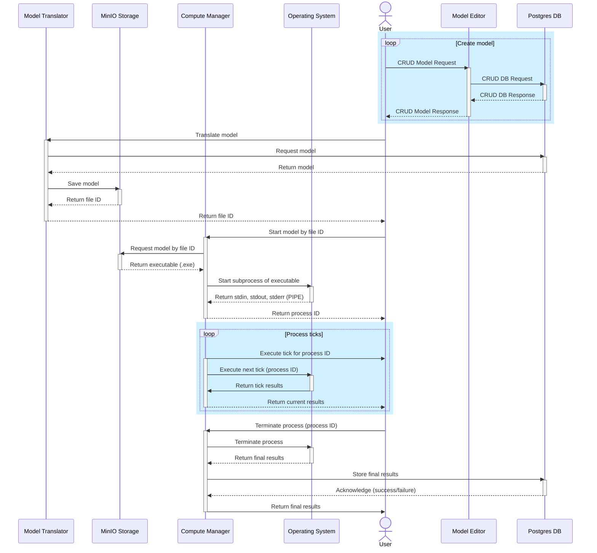

# AT_Simulation

Микросервис подсистемы имитационного моделирования АТ-ТЕХНОЛОГИЯ

## Общая схема вычислений

```mermaid
sequenceDiagram
    participant Translator as Model Translator
    participant Minio as MinIO Storage
    participant ComputeManager as Compute Manager
    participant OS as Operating System
    actor User as User
    participant Editor as Model Editor
    participant Postgres as Postgres DB

    rect rgb(102, 204, 255, .3)
        loop Create model
            User ->> Editor: CRUD Model Request
            activate Editor
            Editor ->> Postgres: CRUD DB Request
            activate Postgres
            Postgres -->> Editor: CRUD DB Response
            deactivate Postgres
            Editor -->> User: CRUD Model Response
            deactivate Editor
        end
    end

    User ->> Translator: Translate model
    activate Translator
    Translator ->> Postgres: Request model
    activate Postgres
    Postgres -->> Translator: Return model
    deactivate Postgres

    Translator ->> Minio: Save model
    activate Minio
    Minio -->> Translator: Return file ID
    deactivate Minio
    Translator -->> User: Return file ID
    deactivate Translator

    User ->> ComputeManager: Start model by file ID
    activate ComputeManager
    ComputeManager ->> Minio: Request model by file ID
    activate Minio
    Minio -->> ComputeManager: Return executable (.exe)
    deactivate Minio

    ComputeManager ->> OS: Start subprocess of executable
    activate OS
    OS -->> ComputeManager: Return stdin, stdout, stderr (PIPE)
    deactivate OS

    ComputeManager -->> User: Return process ID
    deactivate ComputeManager

    rect rgb(102, 204, 255, .3)
        loop Process ticks
            ComputeManager ->> User: Execute tick for process ID
            activate ComputeManager
            ComputeManager ->> OS: Execute next tick (process ID)
            activate OS
            OS ->> ComputeManager: Return tick results
            deactivate OS
            ComputeManager -->> User: Return current results
            deactivate ComputeManager
        end
    end

    User ->> ComputeManager: Terminate process (process ID)
    activate ComputeManager
    ComputeManager ->> OS: Terminate process
    activate OS
    OS -->> ComputeManager: Return final results
    deactivate OS

    ComputeManager ->> Postgres: Store final results
    activate Postgres
    Postgres -->> ComputeManager: Acknowledge (success/failure)
    deactivate Postgres
    ComputeManager ->> User: Return final results
    deactivate ComputeManager

```
